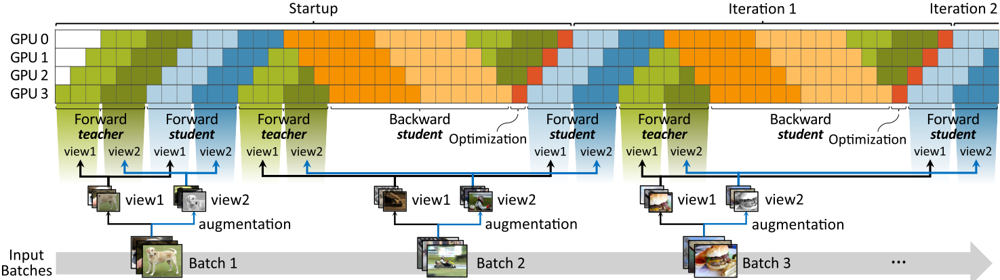

# TSPipe: Learn from Teacher Faster with Pipelines



This is an anonymized repository of TSPipe provided for review.

## Benchmarks
- Knowledge Distillation (KD)
    - [Soft target](./benchmarks/soft_target)
    - [Distilbert](./benchmarks/distilbert)
- Momentum-network-based Self-Supervised Learning (SSL)
    - [BYOL](./benchmarks/byol)
    - [MoCo-v3](./benchmarks/moco-v3)


## How to install
Tested on Python 3.9.7 and PyTorch 1.12.0.

1. Install dependencies

    ```bash
    conda create -n tspipe -y python=3.9
    conda activate tspipe
    conda install -y -c pytorch pytorch torchvision torchaudio cudatoolkit=11.3 tqdm tensorboard
    conda install -y -c huggingface transformers psutil tensorboardX GitPython
    pip install timm==0.4.9
    ```

2. Configure `/etc/hosts` to enable inter-node communication. **`/etc/host` must have the entry that relates its hostname to its IP address of the network interface used for inter-node communication**.
For example, two nodes with hostname `node1` (10.0.0.1) and `node2` (10.0.0.2) should be set as:
    - `/etc/hosts` in `node1`
        ```
        127.0.0.1 localhost
        10.0.0.1 node1
        ```
    - `/etc/hosts` in `node2`
        ```
        127.0.0.1 localhost
        10.0.0.2 node2
        ```
        

3. Configure the maximum number of open files. Recommended value is 409600. You can achieve this by either of followings:
    - Add entry to `/etc/security/limits.conf` (Ubuntu)
        ```
        #<domain>   <type>  <item>  <value>
        *           soft    nofile  409600
        *           hard    nofile  409600
        ```

    -  Enter `ulimit -n 409600` in the shell before running.

## Credit
Some of the codes were borrowed from following repositories:
- https://github.com/kakaobrain/torchgpipe
- https://github.com/sthalles/PyTorch-BYOL
- https://github.com/facebookresearch/moco-v3
- https://github.com/AberHu/Knowledge-Distillation-Zoo
- https://github.com/huggingface/transformers
